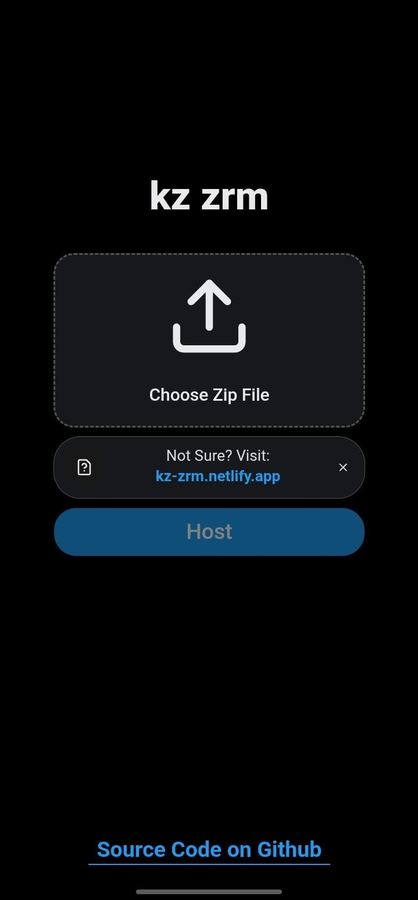
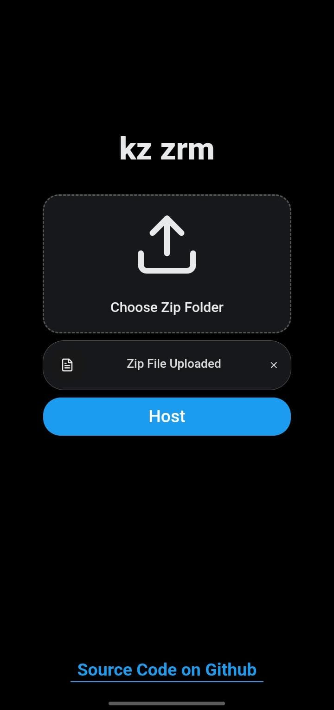
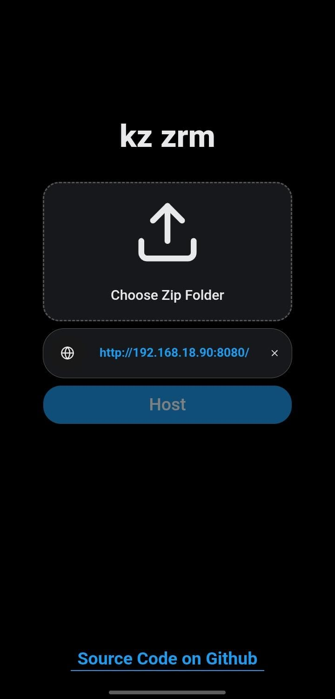

# kz zrm

## Preview

  <table>
    <tr>
      <td width="25%" align="center">
        
      </td>
      <td width="25%" align="center">
        
      </td>
      <td width="25%" align="center">
        
      </td>
    </tr>
  </table>

## Website
For detail visit: https://kz-zrm.netlify.app/

## Overview

This app was made to make it easier to host files for ps4 homebrew on local your devices without much setup.

## Supported Platform

- Linux
- Android
- Windows
- Macos

## Downloads

Visit https://kz-zrm.netlify.app/download or [releases](https://github.com/karimdevelops/kz-zrm-app/releases) to download for your device.

## Disclaimer

- Please note that we do not host anything illegal. If something is mentioned, it is a third party provider.

- This app only allows you to host files you want for playstation browser, it is not in our control neither we are responsible for what you do.

- Do not forget to enjoy and report any bugs :>
